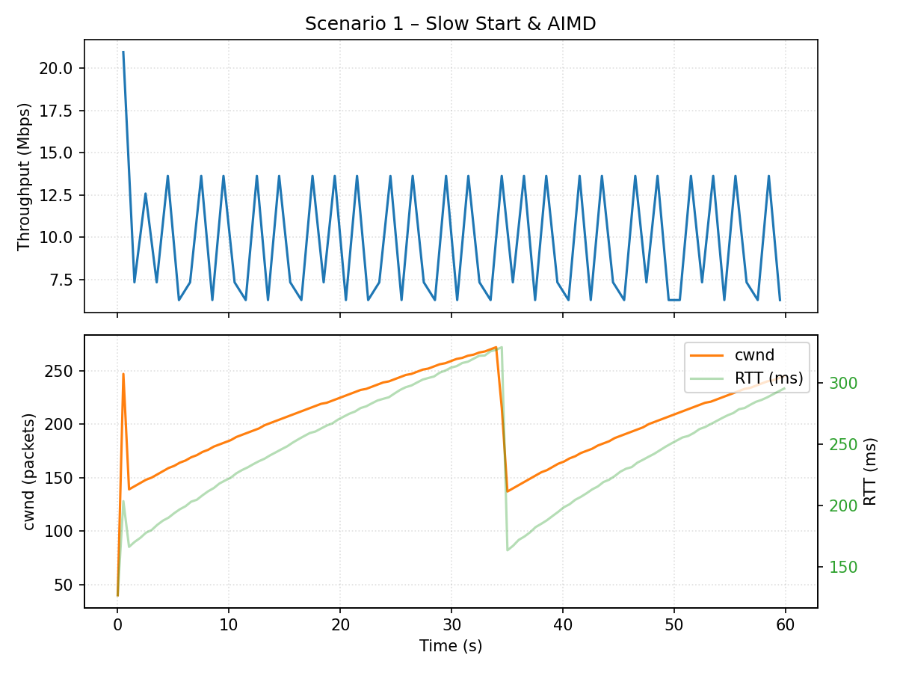
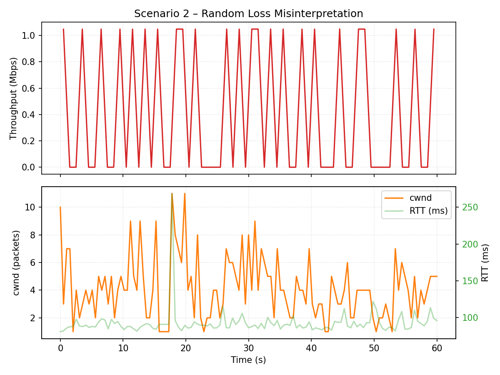
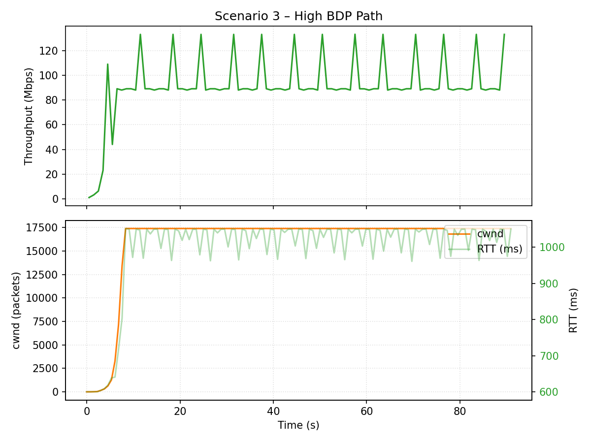
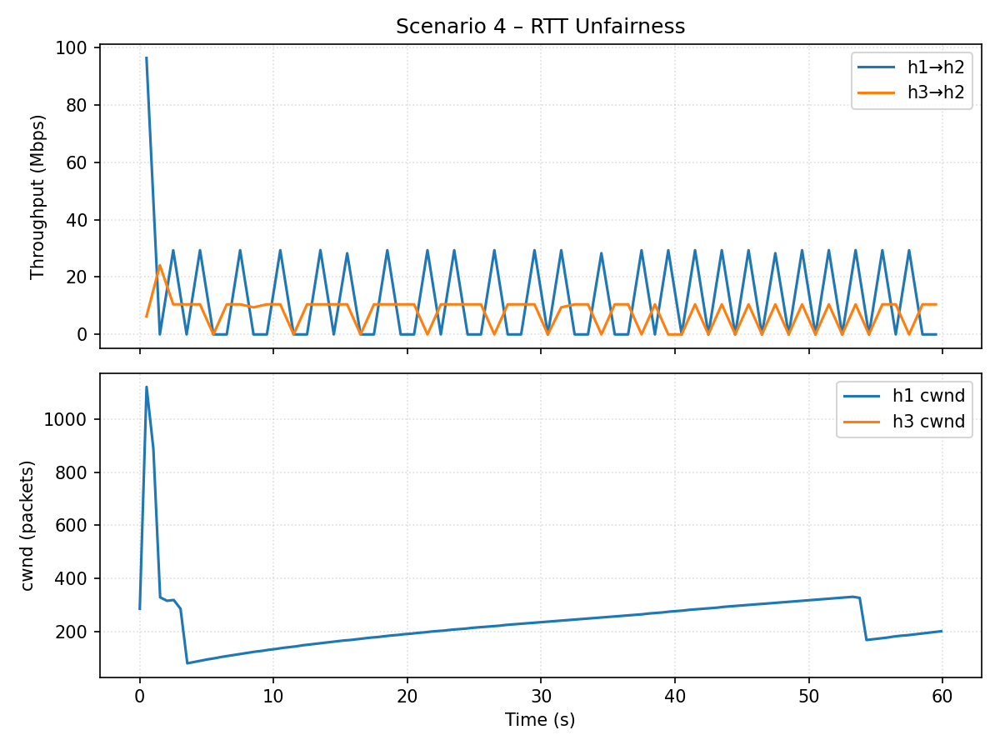
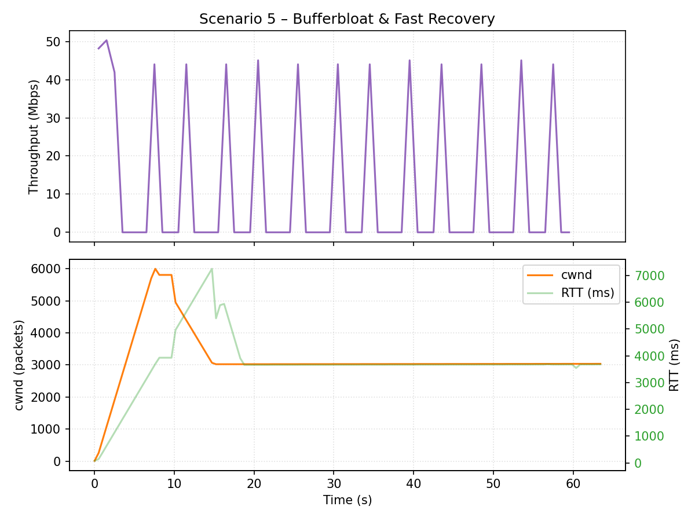

# TCP Reno Baseline 실험 정리 (2025-10-29)

## 1. 생성한 파일과 실행 흐름
- `experiments/1029/run_scenarios.py`  
  Mininet 토폴로지를 자동 구성하고 다섯 가지 Reno 시나리오를 순차 실행하면서 iperf3 JSON 로그와 `ss -tin` 기반 cwnd/RTT 스냅샷을 수집합니다. 실행은 `sudo python3 experiments/1029/run_scenarios.py`로 진행했습니다.
- `experiments/1029/generate_visuals.py`  
  수집한 `summary.json`과 cwnd 로그를 이용해 처리량·cwnd 그래프(PNG)와 요약 표(`metrics_table.md`)를 생성합니다. 명령은 `python3 experiments/1029/generate_visuals.py`를 사용했습니다.
- 실험 로그 구조  
  각 시나리오별 디렉터리 (`scenario*_.../`) 안에 `*_client.json`, `*_server.log`, `*cwnd.log`가 저장되어 추후 분석 및 리포트 작성에 활용됩니다.

## 2. 과제 요구 환경과 준비한 설정
- 과제 가이드: Ubuntu 20.04 + Mininet, iperf3, Linux 커널 모듈 빌드 환경(`reno_custom.c` + Makefile) 사용을 권장.
- 현재 실습 환경: Ubuntu 22.04지만 동일 패키지를 설치하여 요구 조건 충족.
  - 시스템 업데이트: `sudo apt update && sudo apt upgrade`
  - 개발·네트워크 도구: `sudo apt install build-essential git vim net-tools iproute2 ethtool`
  - 성능 측정 및 에뮬레이터: `sudo apt install iperf3 mininet`
  - Python 시각화 툴: `sudo apt install python3-pip python3-matplotlib` (pip 설치 후 그래프 생성을 위해 사용)
  - 커널 헤더/소스: `sudo apt install linux-headers-$(uname -r) linux-source`
- 과제에서 요구하는 모듈 실험 대비  
  `~/tcp_simple_custom` 디렉터리와 PDF에서 제시한 `Makefile` 구조를 참고해 C 기반 모듈(`reno_custom.c`)을 빌드할 준비를 마쳤으며, 실험 시 기본 혼잡제어를 `sudo sysctl net.ipv4.tcp_congestion_control=reno`로 설정해 Reno 기준선을 확보했습니다.

## 3. 실험 결과 요약

| 시나리오 | 링크 조건 | 평균 처리량 (Mbps) | 관찰 포인트 |
| --- | --- | --- | --- |
| Scenario 1 – Slow Start & AIMD | h1—s1—h2 · bw=10 Mbps · delay=30 ms · queue=100 | 9.49 | Slow start 이후 선형 증가, 손실 시 cwnd 절반 감소 |
| Scenario 2 – Random Loss Misinterpretation | h1—s1—h2 · bw=10 Mbps · delay=20 ms · loss=5% | 0.40 | 비혼잡 손실에도 Reno가 감속 → 평균 처리량 급락 |
| Scenario 3 – High BDP Path | h1—s1—h2 · bw=100 Mbps · delay=150 ms · queue=2000 | 89.98 | RTT↑ 환경에서 선형 증가 속도가 느려 파이프 미충족 |
| Scenario 4 – RTT Unfairness | h1/h3—s1—h2 · (h1:10 ms, h3:100 ms) · bw=20 Mbps | h1: 12.28 / h3: 7.07 (Jain 0.93) | 짧은 RTT 흐름이 대역폭 대부분 획득, Jain 지수 0.93 |
| Scenario 5 – Bufferbloat & Fast Recovery | h1—s1—h2 · bw=10 Mbps · delay=20 ms · queue=2000 | 9.52 | 크게 부푼 큐로 RTT 급증, Fast Retransmit/Recovery 반복 |

### Scenario 1 – 기본 AIMD & Slow Start

- 초반 slow start 구간에서 cwnd가 지수적으로 증가한 뒤 선형 증가(1 RTT당 1 MSS) 단계로 전환.
- 손실 시점마다 cwnd가 절반으로 떨어져 throughput이 톱니모양으로 반복 변동.

### Scenario 2 – 손실=혼잡 오판

- 무작위 오류 손실(5%)에도 Reno는 혼잡으로 판단해 cwnd를 급격히 낮춤.
- 평균 처리량이 0.4 Mbps 수준으로 급락하고, cwnd가 회복과 감소를 반복.

### Scenario 3 – 고 RTT·고 BDP 비효율

- 왕복 지연이 큰 환경에서 선형 증가 속도가 부족해 링크 용량 100 Mbps를 완전히 활용하지 못함.
- 손실 이후 회복 역시 느려 파이프가 비는 시간이 길다.

### Scenario 4 – RTT 불공정성

- 짧은 RTT 흐름(h1)이 더 자주 ACK를 받아 cwnd를 빠르게 키움 → 12.28 Mbps 확보.
- 긴 RTT 흐름(h3)은 cwnd 증가가 더뎌 7.07 Mbps에 머무르고, Jain 지수 0.93으로 공평성 훼손.

### Scenario 5 – 버퍼블로트 & Fast Recovery

- 큐가 과도하게 크면 RTT가 급증하며 지터도 커짐.
- 중복 ACK 누적 후 Fast Retransmit/Recovery가 작동해 cwnd가 절반으로 줄고 서서히 회복하는 패턴 확인.

## 4. 확인된 TCP Reno 한계 (향후 개선 포인트)
- **비혼잡 손실 구분 불가**: 무선 링크 등에서 발생한 오류 손실도 혼잡으로 간주해 필요 이상으로 전송률을 낮춤.
- **높은 RTT·대역폭 환경 대응 미흡**: 선형 증가만으로는 큰 BDP를 빠르게 채우기 어려워 링크 활용률이 떨어짐.
- **RTT 불공정성**: 짧은 RTT 흐름이 오히려 더 많은 대역폭을 차지해 공평성 문제가 발생.
- **버퍼블로트 취약**: 큐가 깊은 환경에서 지연이 크게 늘고, 패킷 지연탐지를 통한 Fast Recovery로 throughput 변동성이 증가.
- **손실 회복 속도 한계**: 손실 이후 복구가 느려 순간 트래픽 허용량이 줄어드는 구간이 반복됨.

위 한계들을 보완하기 위해 `reno_custom.c` 모듈에서 손실 판별·윈도우 조정 로직을 개선하고, 동일한 테스트 파이프라인으로 성능 향상을 검증할 예정이다.
